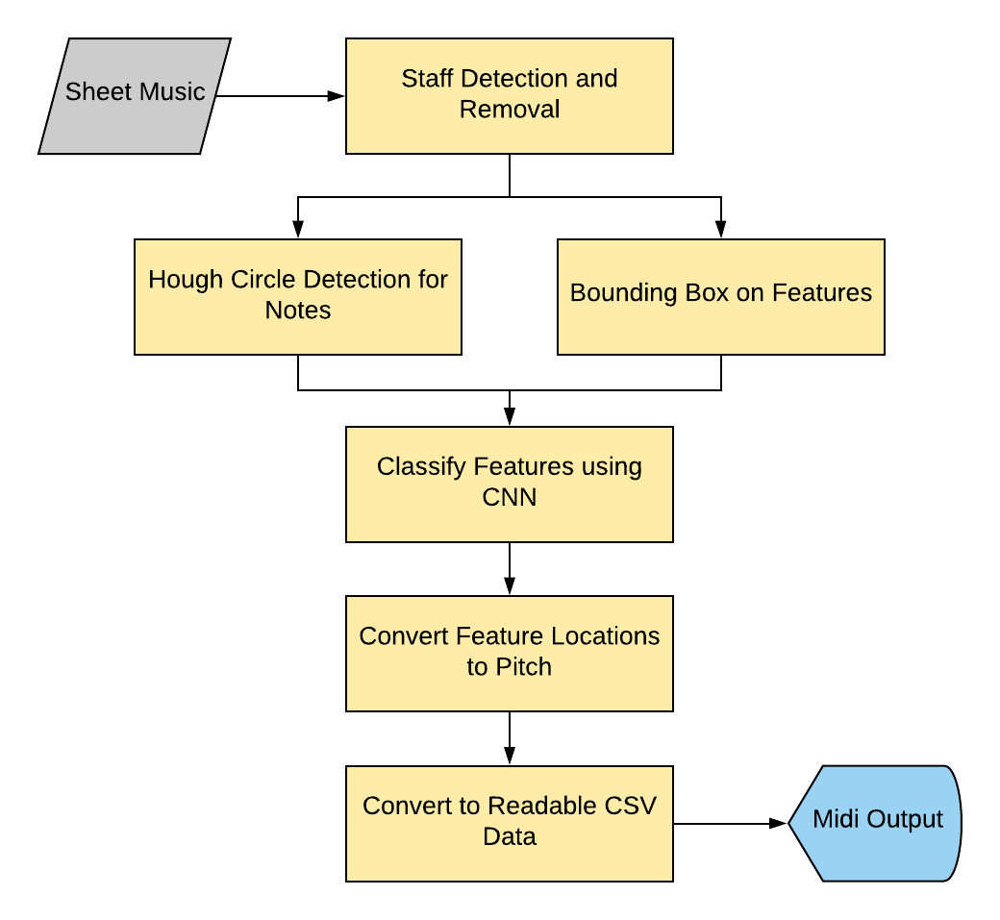

# Optical Music Recognition Final Project
This project was done as the final project for CS1430 (Computer Vision) at Brown. The problem was to take in an image of sheet music and output the corresponding MIDI file of the music being played.

Collaborators:
- Sorin Cho
- Jusung Lee
- Sohum Gupta

# Overall Process

